# Ubuntu 24.04をBtrfs (RAID 1)でセットアップ
## ステップ1
### GNU GRUB画面


「Try or Install Ubuntu」にフォーカスを当てて、Enterキーを押下する。

### Ubuntuへ、ようこそ（Welcome to Ubuntu）画面


「日本語」を選択して、「次」ボタンをクリックする。

### アクセシビリティ（Accessobility）画面
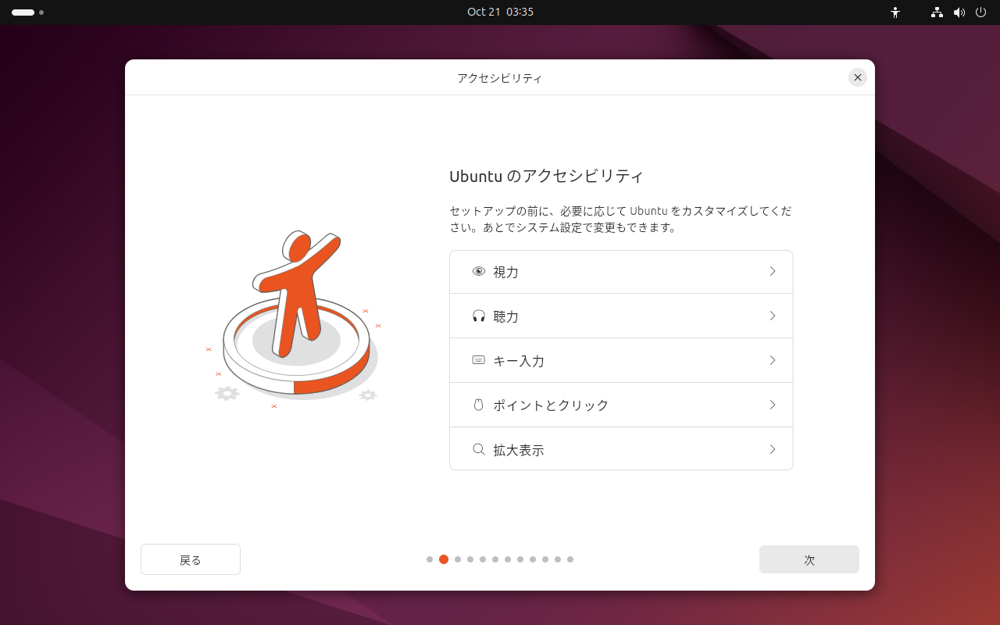

「次」ボタンをクリックする。

### キーボードレイアウト（Keyboard layout）画面


「日本語」とキーボードバリアント「日本語」を選択して、「次」ボタンをクリックする。

### ネットワークに接続（Internet connection）画面
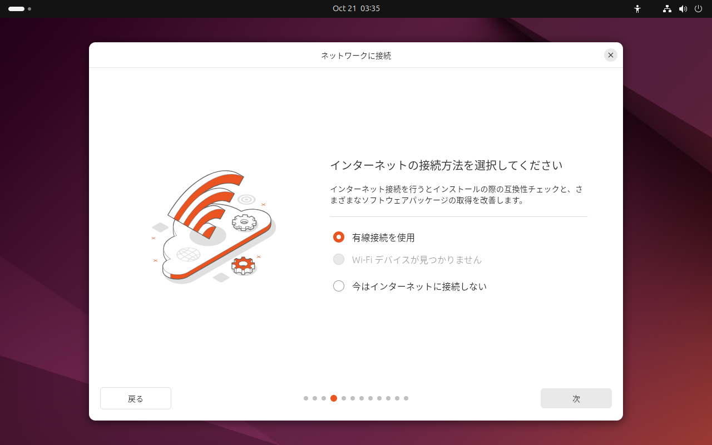

「有線接続を使用」を選択して、「次」ボタンをクリックする。

### Ubuntuを試用またはインストール（Try or install Ubuntu）画面
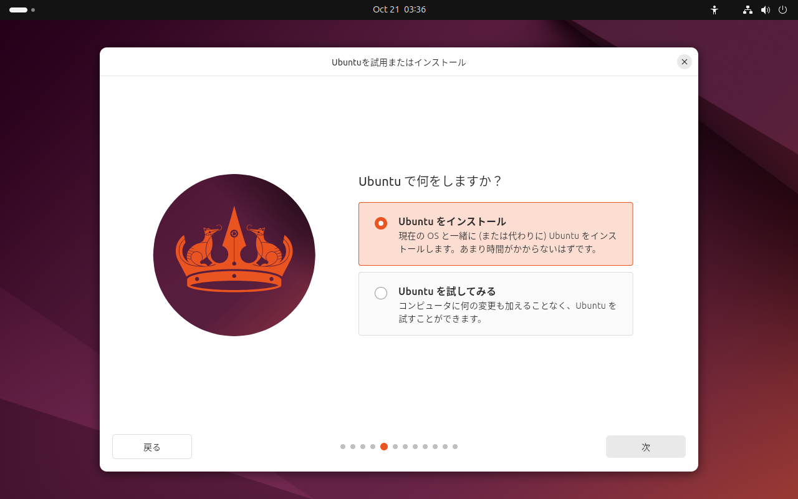

「Ubuntuをインストール」を選択して、「次」ボタンをクリックする。

### インストール方法を選択（Type of installation）画面


「次」ボタンをクリックする。

### アプリケーション（Applications）画面
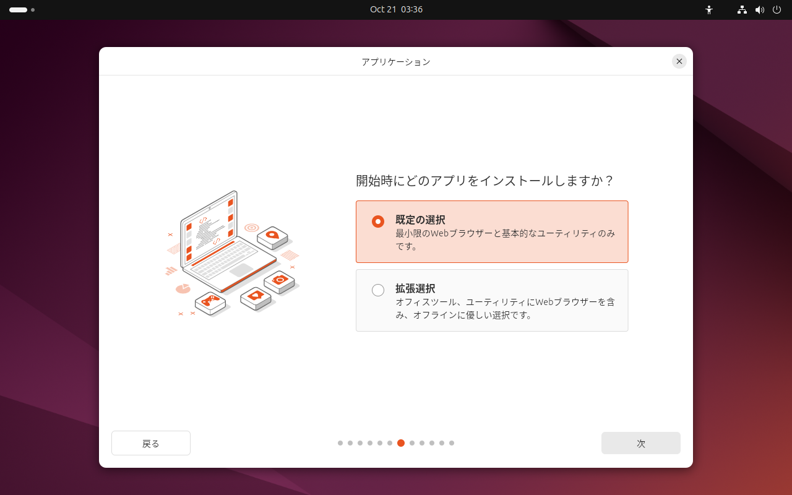

「既定の選択」を選択して、「次」ボタンをクリックする。

### ディスクのセットアップ（Disk setup）画面

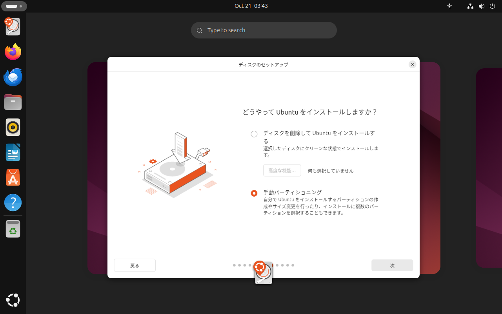


1. 左上の「アクティビティ」ボタンをクリック
1. 左下の「アプリケーションを表示する」ボタンをクリック
1. 「Taminal」をクリック

### ターミナル画面


スクリプトによってインストール先のストレージ2台をフォーマットする。

まず、スクリプトをダウンロードして、そのディレクトリーに移動する。
```sh
sudo apt install -y git
git clone --depth=1 https://github.com/hydratlas/tips
cd tips/debian-and-ubuntu-tips/install-ubuntu-with-btrfs
```

lsblkコマンドでインストール先のストレージの名前（sdX）を確認する。
```sh
lsblk -fe7
```

インストール先のストレージを、スクリプトによってフォーマットする。
```sh
sudo ./parted.sh sdX
sudo ./parted.sh sdX
```

終わったら、ターミナル画面を閉じる。

## ステップ2
### ディスクのセットアップ（Disk setup）画面


「手動パーティショニング」を選択して、「次」ボタンをクリックする。

### 手動パーティショニング（Manual partitioning）画面
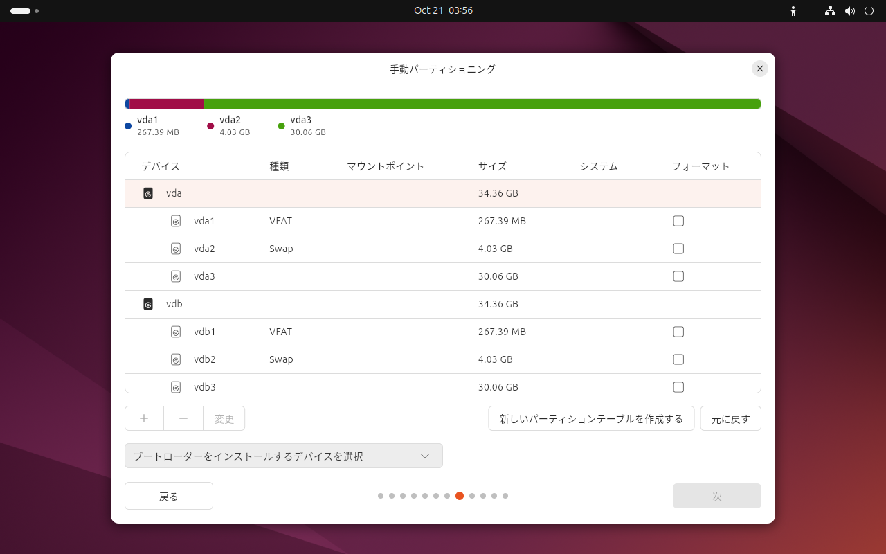

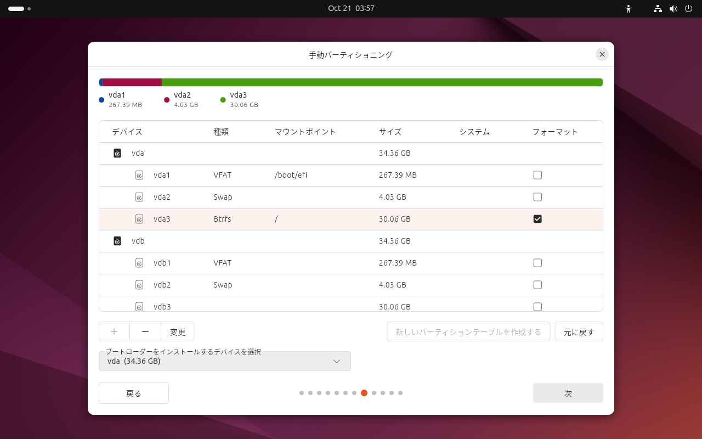

1. ブートローダーをインストールするデバイスとして、一台目のストレージを選択する
1. 一台目のストレージの第三パーティション（この場合は「vda3」）を選択
1. 「変更」ボタンをクリック
1. 「パーティションを編集する」画面が表示されるので、Btrfsと/を選択して、「OK」ボタンをクリックする
1. 「次」ボタンをクリックする

### アカウントの設定（Create your account）画面
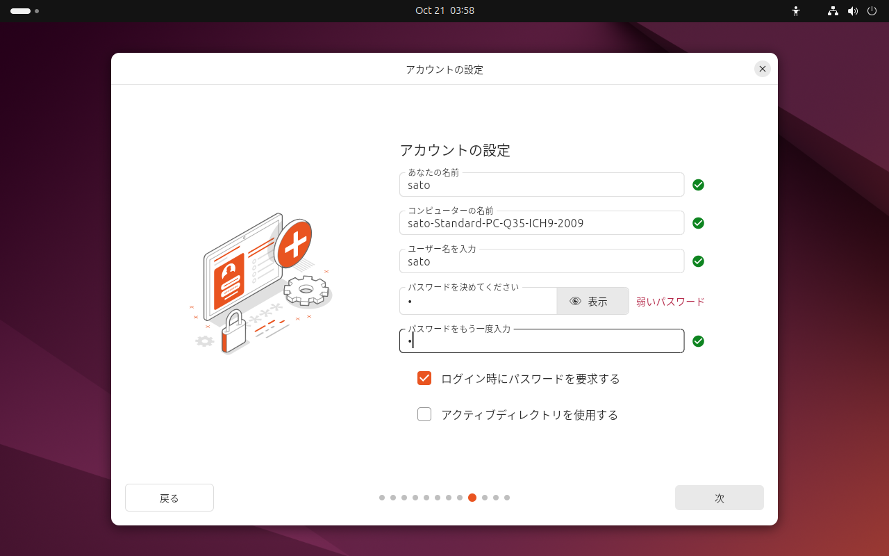

任意の値を入力して、「次」ボタンをクリックする。

### タイムゾーンを選択してください（Select your timezone）画面
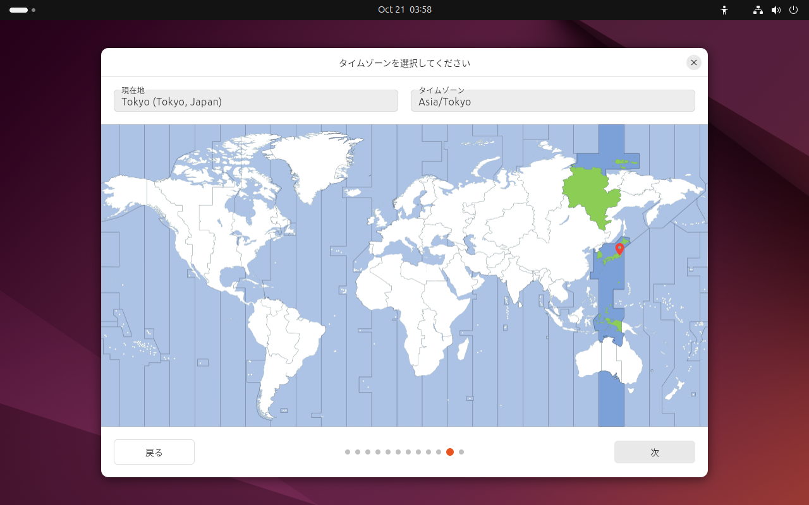

「Tokyo」と「Asia/Tokyo」を選択して、「次」ボタンをクリックする。

### インストールの準備完了（Ready to install）画面
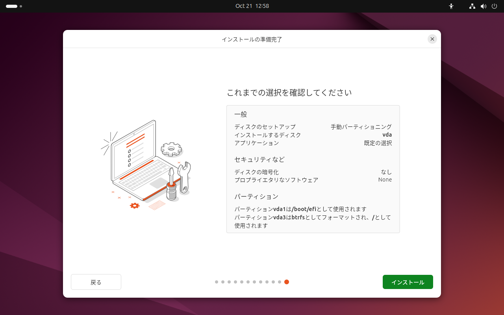

確認して、「インストール」ボタンをクリックする。

### インストールが完了しました（Installation complete）画面

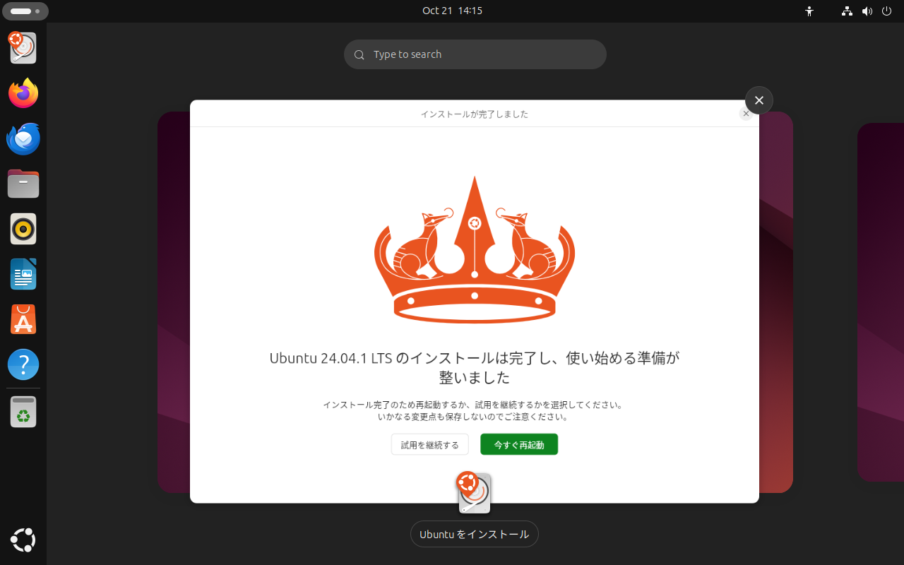
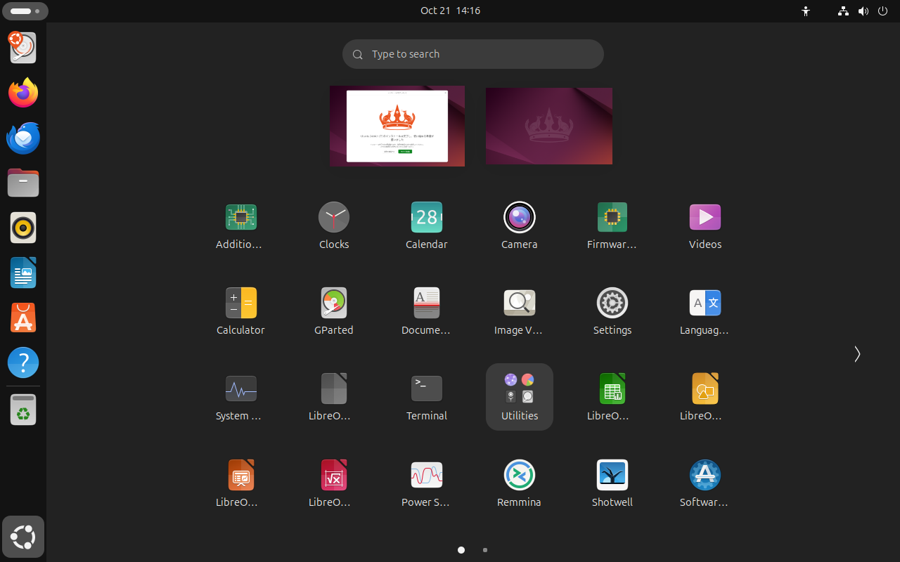

1. 左上の「アクティビティ」ボタンをクリック
1. 左下の「アプリケーションを表示する」ボタンをクリック
1. 「Taminal」をクリック

### ターミナル画面
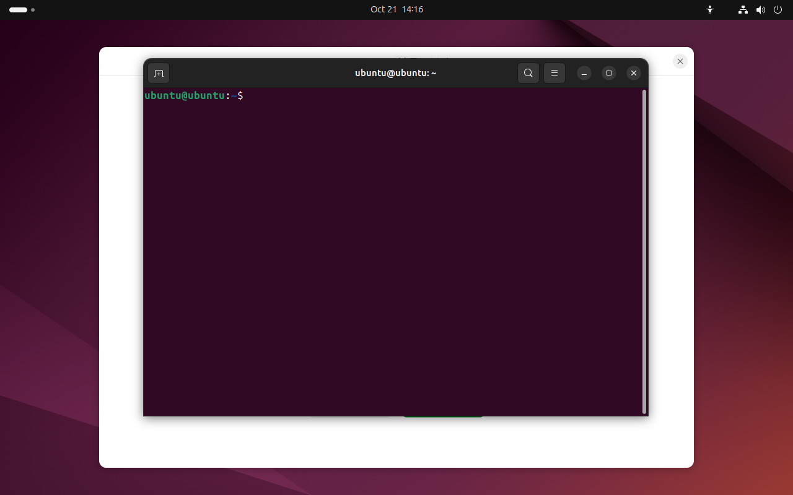

スクリプトのディレクトリーに移動する。
```sh
cd tips/debian-and-ubuntu-tips/install-ubuntu-with-btrfs
```

lsblkコマンドでインストール先のストレージの名前（sdX）を確認する。
```sh
lsblk -fe7
```

インストール先のストレージを、スクリプトによってBtrfsをRAID 1にするとともに、Snapperに対応したサブボリュームのレイアウトにし、さらにfstabとブートローダーをそれに合わせた構成に更新する。ただし、1台だけ指定した場合には、RAID 1ではなくシングル構成にする。第一引数のストレージから第二引数のストレージにコピーしてRAID 1構成にするため、引数の順番には注意すること。
```sh
sudo ./install.sh sdX sdX
```

終わったら、ターミナル画面を閉じる。

## ステップ3
### インストールが完了しました（Installation complete）画面


「今すぐ再起動する」ボタンをクリックする。
