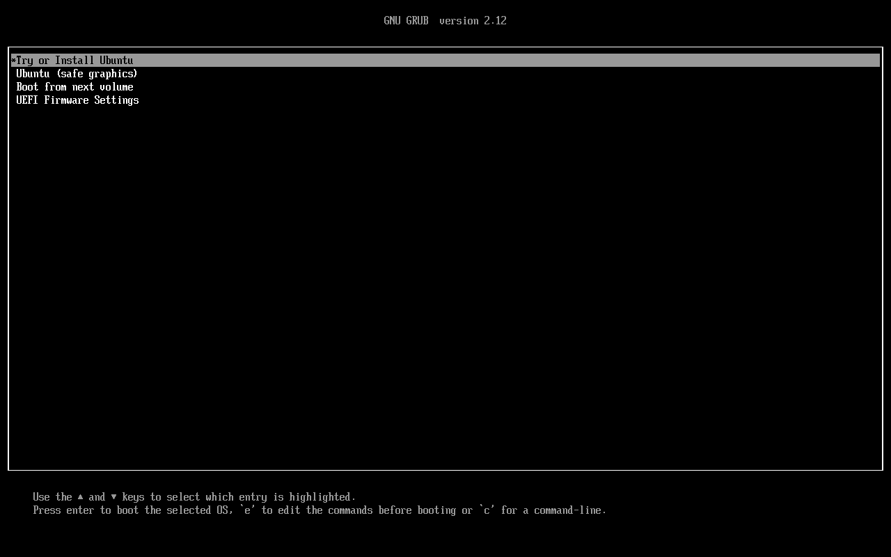

# Ubuntu 23.10をBtrfs (RAID 1)でセットアップ
## ステップ1
### GNU GRUB画面

「Try or Install Ubuntu」にフォーカスを当てて、Enterキーを押下する。

### Ubuntuへ、ようこそ。（Welcome to Ubuntu）画面

「日本語」を選択して、「Next」ボタンをクリックする。

### Ubuntuを試してみるか、インストールします（Try or install Ubuntu）画面

「Ubuntuをインストール」を選択して、「Next」ボタンをクリックする。

### キーボードレイアウト（Keyboard layout）画面

「日本語」とキーボードバリアント「日本語」を選択して、「Next」ボタンをクリックする。

### ネットワークに接続（Connect to a network）画面

「有線接続を使用」を選択して、「Next」ボタンをクリックする。

### Update available画面

「Skip」ボタンをクリックする。

### アプリケーションとアップデート（Applications and updates）画面

「Default installation」を選択して、「Next」ボタンをクリックする。

### インストール方法を選択（Type of installation）画面


1. 左上の「アクティビティ」ボタンをクリック
1. 左下の「アプリケーションを表示する」ボタンをクリック
1. 「Taminal」をクリック

### ターミナル画面

スクリプトによってインストール先のストレージ2台をフォーマットする。

まず、スクリプトをダウンロードして、そのディレクトリーに移動する。
```
sudo apt install git
git clone --depth=1 https://github.com/hydratlas/tips
cd tips/debian-and-ubuntu-tips/install-ubuntu-with-btrfs
```

lsblkコマンドでインストール先のストレージの名前（sdX）を確認する。
```
lsblk -f -e 7
```

インストール先のストレージを、スクリプトによってフォーマットする。
```
sudo bash -x btrfs1.sh sdX
sudo bash -x btrfs1.sh sdX
```

終わったら、ターミナル画面を閉じる。

## ステップ2
### インストール方法を選択（Type of installation）画面

「手動パーティショニング」を選択して、「Next」ボタンをクリックする。

### 手動パーティショニング（Manual partitioning）画面


1. ブートローダーをインストールするデバイスとして、一台目のストレージを選択する
1. 一台目のストレージの第三パーティション（この場合は「vda3」）を選択
1. 「変更」ボタンをクリック
1. 「パーティションを編集する」画面が表示されるので、Btrfsと/を選択して、「OK」ボタンをクリックする
1. 「Next」ボタンをクリックする

### インストールの準備完了（Ready to install）画面

確認して、「インストール」ボタンをクリックする。

### タイムゾーンを選択してください。（Select your timezone）画面

「Tokyo」と「Asia/Tokyo」を選択して、「Next」ボタンをクリックする。

### アカウントの設定（Set up your account）画面

任意の値を入力して、「Next」ボタンをクリックする。

### テーマを選択してください。（Choose your theme）画面

任意のテーマを選択して、「Next」ボタンをクリックする。

### インストールが完了しました（Installation complete）画面


1. 左上の「アクティビティ」ボタンをクリック
1. 左下の「アプリケーションを表示する」ボタンをクリック
1. 「Taminal」をクリック

### ターミナル画面

スクリプトのディレクトリーに移動する。
```
cd tips/debian-and-ubuntu-tips/install-ubuntu-with-btrfs
```

lsblkコマンドでインストール先のストレージの名前（sdX）を確認する。
```
lsblk -f -e 7
```

インストール先のストレージを、スクリプトによってBtrfsをRAID 1にするとともに、Snapperに対応したサブボリュームのレイアウトにし、さらにfstabとブートローダーをそれに合わせた構成に更新する。ただし、1台だけ指定した場合には、RAID 1ではなくシングル構成にする。第一引数のストレージから第二引数のストレージにコピーしてRAID 1構成にするため、引数の順番には注意すること。
```
sudo bash -eux btrfs2.sh sdX sdX
```

終わったら、ターミナル画面を閉じる。

## ステップ3
### Installation complete画面

「今すぐ再起動する」ボタンをクリックする。
